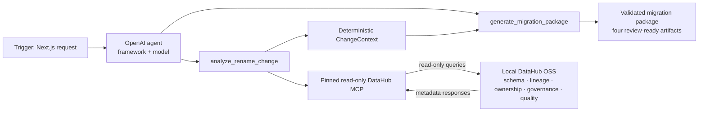

# Agent Demo Architecture

## Reference Architecture

This clean-room diagram is adapted conceptually from the official hackathon build-session
reference architecture. LineageGuard has no SQL execution, notification, incident, arbitrary API,
or DataHub write-back action.

## Agent Building Blocks

| Building block | LineageGuard implementation                                          |
| -------------- | -------------------------------------------------------------------- |
| Framework      | OpenAI TypeScript Agents SDK with one bounded manager agent          |
| Tools          | Exactly `analyze_rename_change` and `generate_migration_package`     |
| Model          | Configurable OpenAI model; fixture provider for deterministic replay |

## Why MCP

MCP is the only runtime DataHub access surface. Agent Context Kit is an architecture reference,
the repository-owned DataHub Skill is a contribution candidate, and Analytics Agent is a
clean-room UX reference. None is a runtime dependency.

## Trust Boundaries

The browser sends one validated rename request to a Node.js Route Handler. The server owns credentials, run IDs, cancellation, and persistence. DataHub metadata and model output are untrusted inputs; Zod schemas, deterministic domain rules, redaction, artifact validation, and atomic file publication are the trust boundaries.

## Exactly Two Agent Tools

The manager agent receives only `analyze_rename_change` and `generate_migration_package`. The first delegates to the application-owned four-operation DataHub adapter and deterministic assessment. The second accepts structured strategy data and invokes deterministic rendering and validation. Raw MCP discovery and provider SDK objects are never exposed to the agent.

## Deterministic Authority

Application code—not the model—owns dataset resolution, completeness, Context Coverage, the unchanged impact score, decision thresholds, physical-name safety, evidence IDs, rendering, and validation. Model-authored strategy cannot lower risk, claim missing evidence, enable execution, or authorize a migration.

## Live and Replay Modes

`LIVE` uses the pinned local DataHub MCP subprocess and configured OpenAI provider. `REPLAY` uses certified sanitized fixtures and a deterministic fake provider with no network calls. The server supplies the visible mode badge at request time; replay never claims a live service check.

## NDJSON Event Protocol

The Route Handler emits only `WorkflowEventSchema` records as `application/x-ndjson`. The client validates every record before rendering. A run has one terminal snapshot, and late events cannot replace a terminal failure, cancellation, or committed completion.

## Flat Run Envelope Storage

Each terminal run is published once as an immutable `run-<run-id>.json` envelope directly beneath
an explicit absolute, pre-created trusted `LINEAGEGUARD_RUNS_DIR`. The envelope is bounded,
strictly parsed, hash-verified, and cross-field validated before use. Completed runs expose only
the four allowlisted virtual migration artifacts; context, draft, findings, hashes, temporary
names, and native paths remain private.

## Artifact Classification

Executable Snowflake SQL is permitted only for a separately verified three-part `database.schema.table` physical name. The golden four-part DataHub name therefore remains `NON_EXECUTABLE_TEMPLATE`; no component may be silently dropped.

## Validation and Repair Limit

The agent receives one initial package attempt and at most one validation-driven repair. Acceptance
closes generation permanently. Failed validation preserves only bounded sanitized private envelope
data and never publishes a completed envelope.

## Cancellation and Timeouts

The browser request, MCP connection and reads, agent run, nested generation, and overall workflow
have explicit abort/deadline handling. Owned subprocesses close, caller-owned temporary envelope
entries are removed before publication, and a late continuation cannot publish `COMPLETED` after
cancellation or failure.

## Secret and Trace Handling

`OPENAI_API_KEY` and `DATAHUB_GMS_TOKEN` remain server-only and are registered with the redactor before any provider call. OpenAI tracing is disabled, raw chain-of-thought and provider traces are never stored, and public errors contain fixed messages plus sanitized run IDs only.

## Known Limitations

The demo supports one Snowflake-first `rename_column` workflow, local filesystem runs, pinned local DataHub MCP `0.6.0`, and a single bounded OpenAI agent. It does not host a public live service, execute SQL, mutate DataHub, manage identities or ingestion, send notifications, operate GitHub, or autonomously approve changes.
